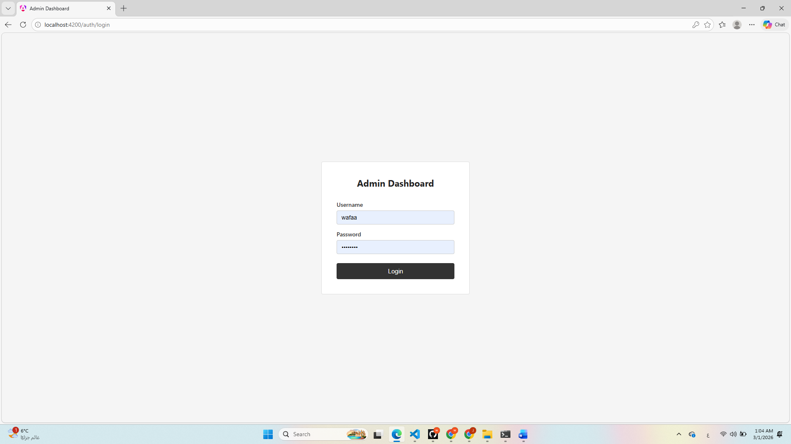
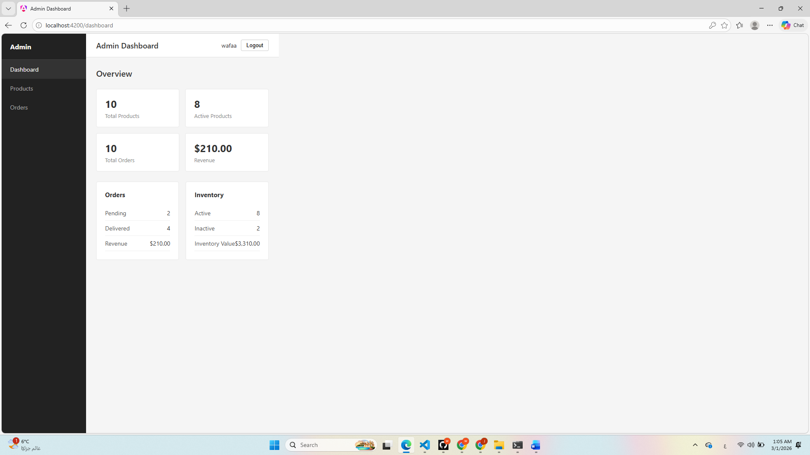
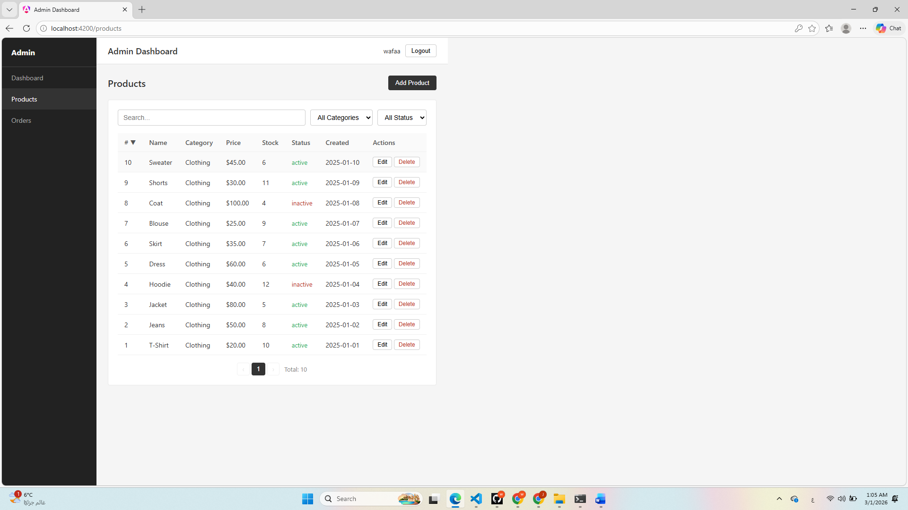
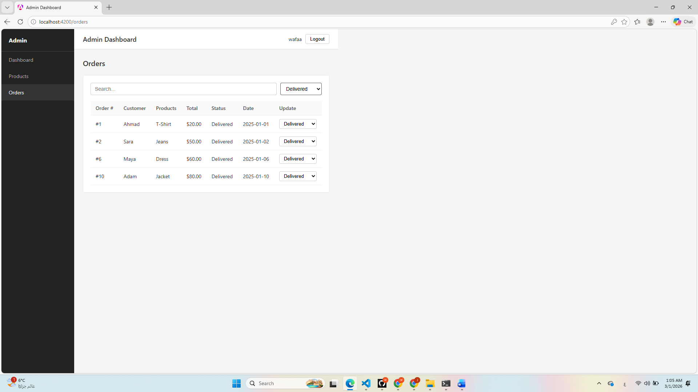
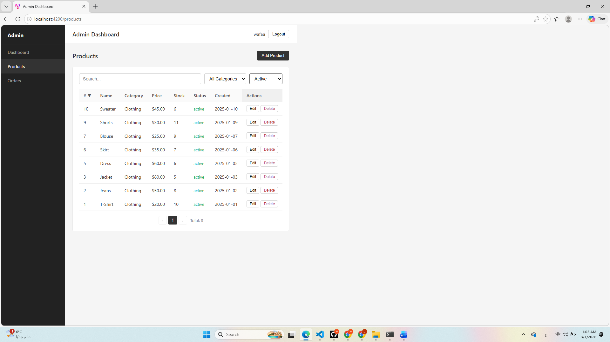
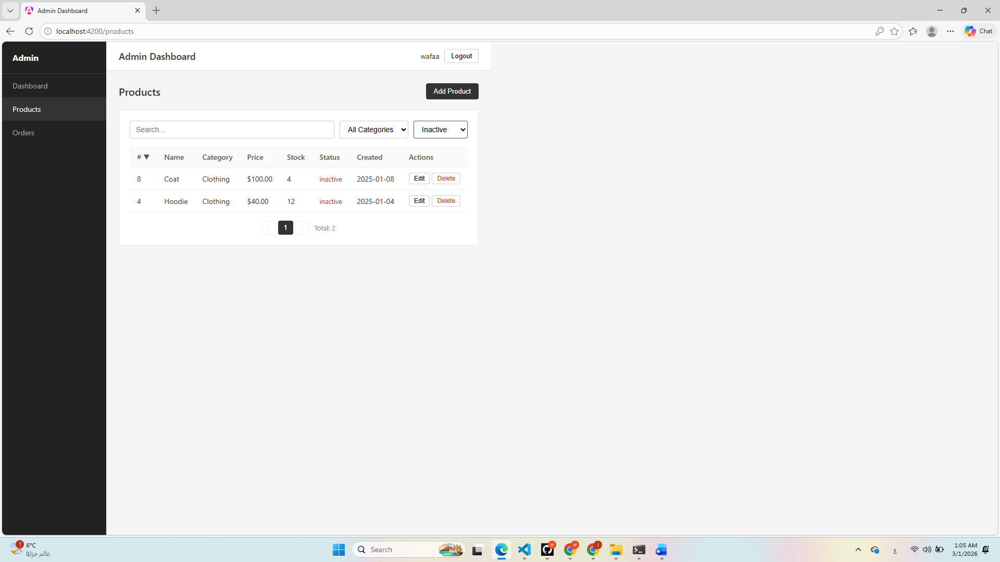
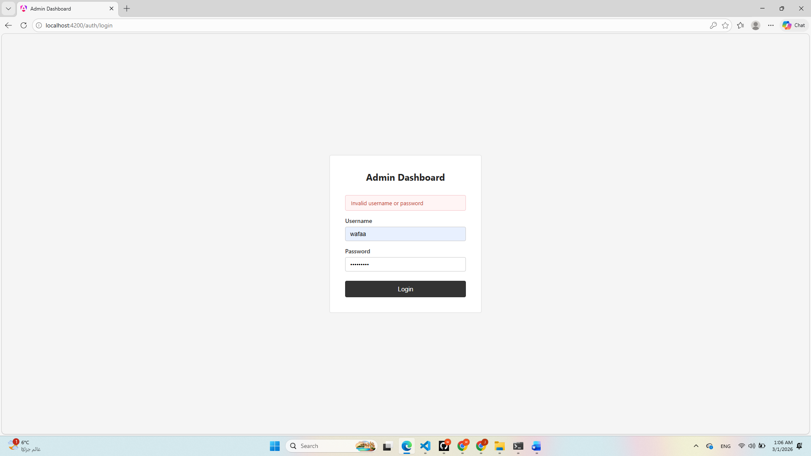
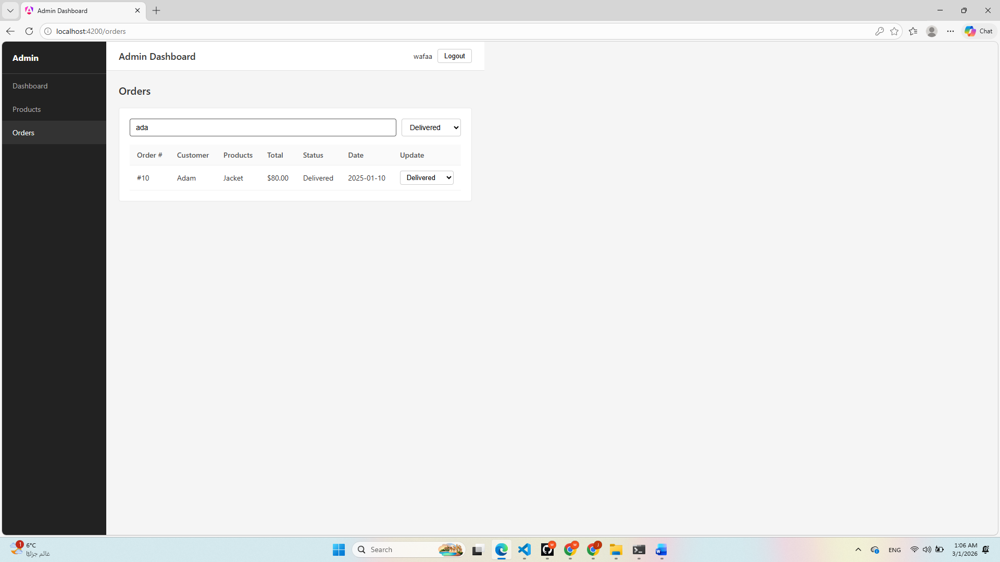

# Admin Dashboard v2

Simple Angular 21.2.0 Admin Dashboard project.

---

## Final Submission

This project is a simple Admin Dashboard built using Angular 17.  
It was created as a technical assignment to practice Angular basics.

---

## How It Works (Simple Explanation)

- I created the project using Angular CLI.
- I built separate pages like Login, Dashboard, Products, and Orders.
- I used routing to navigate between pages.
- I added an Auth Guard to protect routes after login.
- I created services to manage data.
- I used Reactive Forms for form validation.
- I organized the project into folders (core and features) to keep it clean.

This project helped me understand how Angular applications are structured and how components and services work together.

---
Open browser at `http://localhost:4200`
## Login Credentials
- Username: `wafaa`
- Password: `wafaa123`

## Screenshots

### Login Page

### Dashboard

### Products

### order

### activeproduct

### inactiveproduct

### invalidlogin

### search

